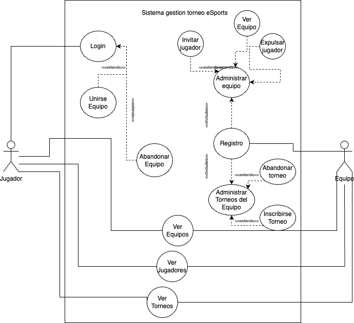
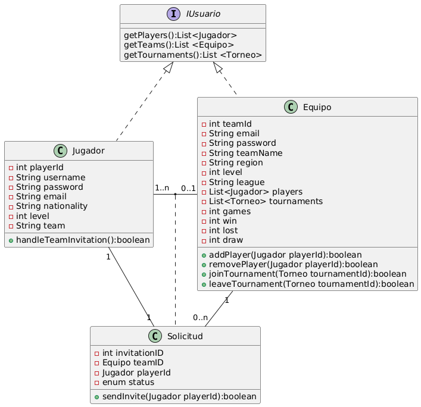

# Entornos de Desarrollo Actividad 3: Sitema gestor de un torneo eSports

##### Hector Gonzalez Mendez

Grado Superior en Desarrollo de aplicaciones Web - UNIR 2024/2025

---

### 1. Análisis del problema

Se nos plantea crear un sistema donde jugadores participen en un torneo o varios. Para poder competir se requiere que estos jugadores formen parte de un equipo.

Dado el enunciado propuesto para esta actividad, decidí en un primer momento investigar plataformas de torneos eSports, para poder entender mejor los requerimientos y poder adaptar e implementar mi idea.

#### 1.1 Actores principales y requisitos:

Definimos a los actores principales como:

- **Jugador**: Podrán ver a otros jugadores, los equipos y los torneos activos sin la necesidad de logearse en la plataforma. Una vez registrados, el usuario será capaz de crear equipos, aceptar/rechazar unirse a un equipo y podrá abandonar un equipo.
   

- **Equipo**: Se encargaran de la autogestión de su plantilla y de la inscripción a los torneos.
   

- **Administrador**: Son los encargados de verficar y comprobar que los esquipos y los jugadores siguen las normas establecidas, los encargados de gestionar las partidas, así como de la configuración de los torneos, partidas y streaming de las mismas. Serán los encargados de validar las partidas.

## 2. Identificación y elaboración de dagrama:

## 3. Identificación de clases y relaciones:

- **Jugador**: La clase jugador dispondrá de una series de atributos y métodos que se especificaran en el diagrama de clase. A destacar la relación con equipo. Un jugador puede estar sin equipo o pertenecer a un solo equipo.
   

  > Relacion 0..1

- **Equipo**:La clase equipo dispondrá de una series de atributos y métodos que se especificaran en el diagrama de clase. A destacar la relación con jugador. Un equipo tiene minimo 1 jugador o muchos.
   

  > Relacion 1..n

  - **SolicitudUnion**:Cada solicitud será única, como norma un jugador solo puede estar en un solo equipo. Para poder unirse a otro equipo el jugador deberá abandonar su equipo actual y luego aceptar la nueva solicitud.
  Un Equipo puede mandar múltiples invitaciones a jugadores o ninguna. Pero solo puede mandar una por jugador.

     

  > Relacion Jugador 1..1
  > Relacion Equipo 0..n

## 4. Diagrama de clase:

## 5. Conclusión:

Después de haber echo un poco de investigación sobre los torneos eSports, decidí crear un sistema que fuera sencillo y accesible. Mi principal razonamiento fue que el usuario pueda jugar lo antes posible y poder disfrutar de la experiencia.

La activadad me ha servido para poner en práctica y entender el uso de los diagramas de clase y de casos.

Sin duda, me gustaría profundizar un poquito más en un futuro cercano y poder seguir practicando su uso.
